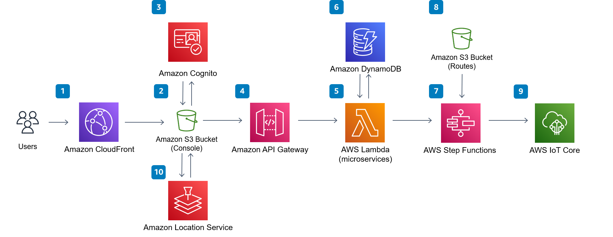

**[IoT Device Simulator](https://aws.amazon.com/solutions/implementations/iot-device-simulator/)** | **[🚧 Feature request](https://github.com/aws-solutions/iot-device-simulator/issues/new?assignees=&labels=enhancement&template=feature_request.md&title=)** | **[🐛 Bug Report](https://github.com/aws-solutions/iot-device-simulator/issues/new?assignees=&labels=bug&template=bug_report.md&title=)** | **[❓ General Question](https://github.com/aws-solutions/iot-device-simulator/issues/new?assignees=&labels=question&template=general_question.md&title=)**

**Note**: If you want to use the solution without building from source, navigate to Solution Landing Page.

## Table of Content
- [Solution Overview](#solution-overview)
- [Architecture Diagram](#architecture-diagram)
- [AWS CDK and Solutions Constructs](#aws-cdk-and-solutions-constructs)
- [Customizing the Solution](#customizing-the-solution)
  - [Prerequisites for Customization](#prerequisites-for-customization)
  - [Unit Test](#unit-test)
  - [Build](#build)
  - [Deploy](#deploy)
- [License](#license)

# Solution Overview
IoT is a sprawling set of technologies and use cases that has no clear, single definition. Despite enormous advances, we’ve only seen a fraction of what the Internet revolution has yet to deliver. That’s because many powerful technological forces are now converging — poised to magnify, multiply, and exponentially increase the opportunities that software and the Internet can deliver by connecting the devices, or “things”, in the physical world around us. Each of these devices is able to convert valuable information from the real world into digital data that provides increased visibility to businesses of how users interact their products or services. The backend services required to process and uncover these valuable insights can be expensive to prove without a large pool of physical devices for full end to end integration setup or time-consuming development of scripts.

Often times, teams constantly have the need to quickly replicate the behavior of their devices interacting with AWS IoT to assess their backend services. The IoT Device Simulator solution is a Graphical User Interface (GUI) based engine designed to enable customers to get started quickly assessing AWS IoT services without an existing pool of devices. The IoT Device Simulator leverages managed, highly available, highly scalable AWS-native services to effortlessly create and simulate thousands of connected devices that are defined by the customer.

For more information and a detailed deployment guide, visit the [IoT Device Simulator](https://aws.amazon.com/solutions/implementations/iot-device-simulator/) solution page.

# Architecture Diagram


# AWS CDK and Solutions Constructs
[AWS Cloud Development Kit (AWS CDK)](https://aws.amazon.com/cdk/) and [AWS Solutions Constructs](https://aws.amazon.com/solutions/constructs/) make it easier to consistently create well-architected infrastructure applications. All AWS Solutions Constructs are reviewed by AWS and use best practices established by the AWS Well-Architected Framework. This solution uses the following AWS Solutions Constructs:
- [aws-cloudfront-s3](https://docs.aws.amazon.com/solutions/latest/constructs/aws-cloudfront-s3.html)
- [aws-lambda-stepfunctions](https://docs.aws.amazon.com/solutions/latest/constructs/aws-lambda-stepfunctions.html)

In addition to the AWS Solutions Constructs, the solution uses AWS CDK directly to create infrastructure resources.
# Customizing the Solution
## Prerequisites for Customization
- Node.js 14.x or later

### 1. Clone the repository
```bash
git clone https://github.com/aws-solutions/iot-device-simulator.git
cd iot-device-simulator
export MAIN_DIRECTORY=$PWD
```

### 2. Declare environment variables
```bash
export REGION=aws-region-code # the AWS region to launch the solution (e.g. us-east-1)
export DIST_BUCKET_PREFIX=my-bucket-name # bucket where customized code will reside, randomized name recommended
export SOLUTION_NAME=my-solution-name # the solution name
export VERSION=my-version # version number for the customized code
```

## Unit Test
After making changes, run unit tests to make sure added customization passes the tests:
```bash
cd $MAIN_DIRECTORY/deployment
chmod +x run-unit-tests.sh
./run-unit-tests.sh
```

## Build
```bash
cd $MAIN_DIRECTORY/deployment
chmod +x build-s3-dist.sh
./build-s3-dist.sh $DIST_BUCKET_PREFIX $SOLUTION_NAME $VERSION
```

## Deploy
* Deploy the distributable to the Amazon S3 bucket in your account. Make sure you are uploading the distributable to the `<DIST_BUCKET_PREFIX>-<REGION>` bucket.
* Get the link of the solution template uploaded to your Amazon S3 bucket.
* Deploy the solution to your account by launching a new AWS CloudFormation stack using the link of the solution template in Amazon S3.

### 3. Deploy the solution
- Get the link of the `iot-device-simulator.template` uploaded to your Amazon S3 bucket.
- Deploy the IoT Device Simulator solution to your account by launching a new AWS CloudFormation stack using the S3 link of the `iot-device-simulator.template`.

# Collection of operational metrics
This solution collects anonymous operational metrics to help AWS improve the quality and features of the solution. For more information, including how to disable this capability, please see the [implementation guide](https://docs.aws.amazon.com/solutions/latest/iot-device-simulator/operational-metrics.html).

# License
Copyright Amazon.com, Inc. or its affiliates. All Rights Reserved.

SPDX-License-Identifier: Apache-2.0